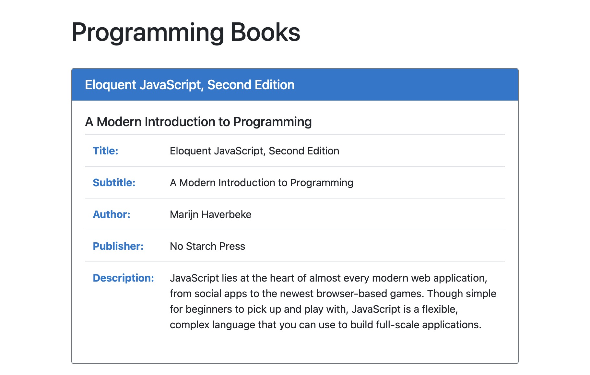

# Books

## Description

An app that displays programming books. Built using React components.

## Installation

1. Simply download the folder to your local machine or fork the project
2. Navigate to the root folder within the terminal
3. Run <code>npm install</code> and <code>npx http-server -c-1</code>.

The app will then open in your browser!

## Future Improvements

Additional styling

## MIT License

Permission is hereby granted, free of charge, to any person obtaining a copy
of this software and associated documentation files (the "Software"), to deal
in the Software without restriction, including without limitation the rights
to use, copy, modify, merge, publish, distribute, sublicense, and/or sell
copies of the Software
  
